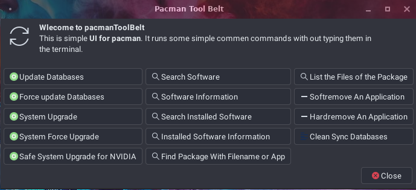

# pacmanToolBox

pacmanToolBox is a simple user front end written using `#bash` and YAD

## Special Thank you

Icons made by <a href="https://www.freepik.com" title="Freepik">Freepik</a> from <a href="https://www.flaticon.com/" title="Flaticon">www.flaticon.com</a>
